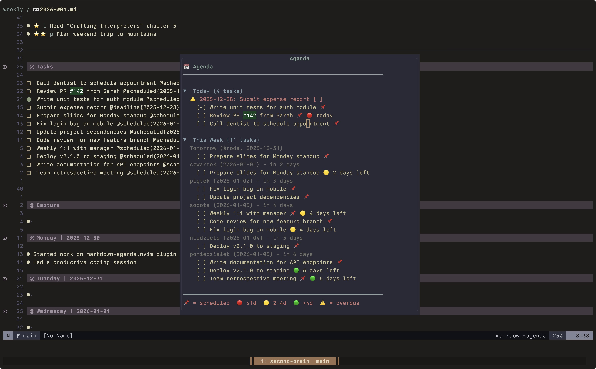

# markdown-agenda.nvim

A minimal, focused agenda view for your markdown notes. Scans your notes directory for tasks with `@scheduled(DATE)` and `@deadline(DATE)` annotations and displays them in a collapsible floating window.




## Features

- **Agenda view** - Today's tasks + weekly overview in a floating window
- **Inline calendar** - Optional month calendar above or side-by-side
- **Deadline urgency** - Visual indicators for deadline proximity
- **Overdue tracking** - Never miss a deadline again
- **Scheduled tasks** - Plan your work with scheduled dates
- **Collapsible sections** - Toggle Today/Week sections with `<Tab>`
- **Clean mode** - Optionally hide the help footer
- **Zero dependencies** - Pure Lua, no external dependencies

## Installation

### [lazy.nvim](https://github.com/folke/lazy.nvim)

```lua
{
  'Kamyil/markdown-agenda.nvim',
  -- Required for :MarkdownAgenda command to be available
  -- Alternatively, use: cmd = 'MarkdownAgenda' for lazy-loading on command
  lazy = false,
  opts = {
    directory = '~/notes',
  },
}
```

### [packer.nvim](https://github.com/wbthomason/packer.nvim)

```lua
use {
  'Kamyil/markdown-agenda.nvim',
  config = function()
    require('markdown-agenda').setup({
      directory = '~/notes',
    })
  end
}
```

## Configuration

```lua
require('markdown-agenda').setup({
  -- Directory to scan for markdown files
  directory = '~/notes',
  
  -- Scan subdirectories recursively
  recursive = true,
  
  -- Date format used in your notes
  -- Options: '%Y-%m-%d' (2025-12-30), '%m/%d/%Y' (12/30/2025), '%d/%m/%Y' (30/12/2025)
  date_format = '%Y-%m-%d',

  -- Show footer help in the agenda window
  show_help = true,

  -- Calendar settings
  calendar = {
    enabled = true,
    months_to_show = 3, -- current month + N-1 months ahead
    position = 'right', -- 'right' or 'top'
    grid_columns = 2,   -- used in 'top' mode (set months_to_show=4 for a 2x2 grid)
  },
  
  -- Customize icons
  icons = {
    scheduled = '📌',
    deadline_urgent = '🔴',  -- ≤1 day
    deadline_soon = '🟡',    -- 2-4 days
    deadline_ok = '🟢',      -- >4 days
    overdue = '⚠️',
    today = '▶',
    collapsed = '▶',
    expanded = '▼',
  },
  
  -- Keymaps (set to false to disable)
  keymaps = {
    open = '<leader>na',
  },
})
```

## Usage

### Task Syntax

Add these annotations to your markdown tasks:

```markdown
- [ ] Call the dentist @scheduled(2025-12-30)
- [ ] Submit report @deadline(2025-12-31)
- [ ] Important meeting @scheduled(2025-12-30) @deadline(2025-12-30)
- [-] In progress task @scheduled(2025-12-30)
```

### Commands

- `:MarkdownAgenda` - Open the agenda view
- `<leader>na` - Open the agenda view (default keymap)

### Agenda Controls

| Key | Action |
|-----|--------|
| `<Enter>` | Jump to task in file |
| `<Tab>` | Toggle section (Today/Week) |
| `<Esc>` / `q` | Close agenda |

### Calendar Colors

Calendar day colors are based on **deadlines only**:

- Overdue deadline -> overdue color
- Deadline in 0-1 day -> urgent color
- Deadline in 2-4 days -> soon color
- Deadline in 5+ days -> ok color
- Today (without deadline status) -> info color

## Task States

| Syntax | Meaning |
|--------|---------|
| `- [ ]` | Todo |
| `- [-]` | In progress |
| `- [x]` | Done (not shown in agenda) |

## Deadline Indicators

| Icon | Meaning |
|------|---------|
| 🔴 | ≤1 day left |
| 🟡 | 2-4 days left |
| 🟢 | >4 days left |
| ⚠️ | Overdue |
| 📌 | Scheduled (no deadline) |

## License

MIT
